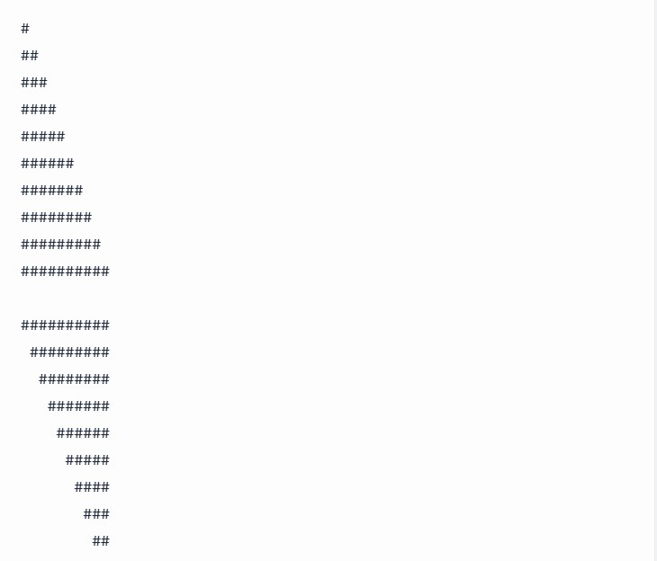
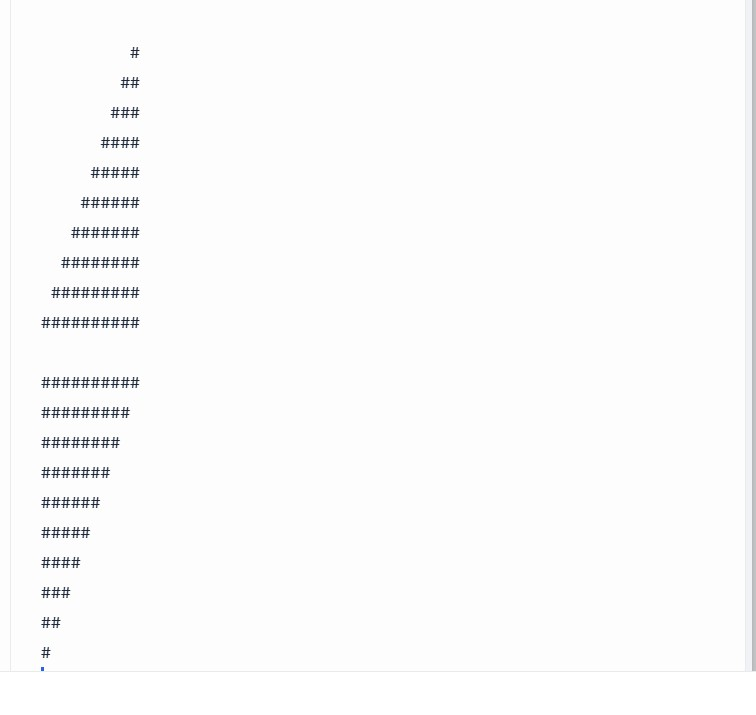
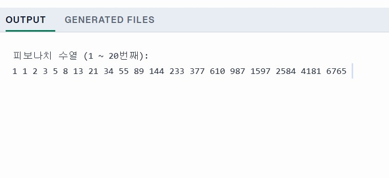
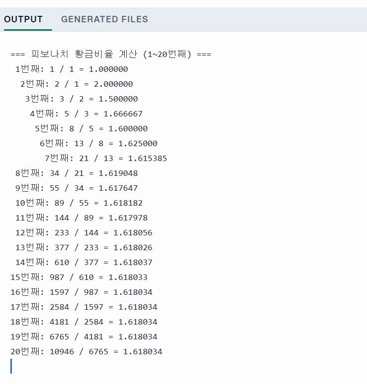
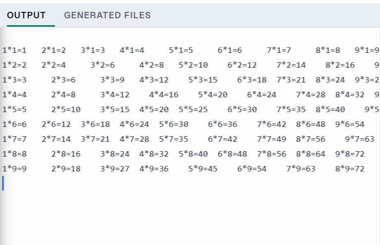
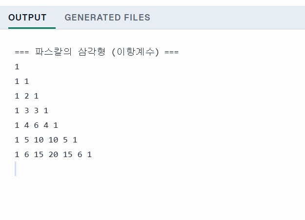

# OOP2026
# Homework1

```java
public class Homework1 {
    public static void main(String[] args) {
        int i, j;

        for (i = 0; i < 10; i++) {
            for (j = 0; j < 10; j++) {
                if (j <= i) {
                    System.out.print("#");
                } else {
                    System.out.print(" ");
                }
            }
            System.out.println("");
        }
        System.out.println("");

        for (i = 0; i < 10; i++) {
            for (j = 0; j < 10; j++) {
                if (j >= i) {
                    System.out.print("#");
                } else {
                    System.out.print(" ");
                }
            }
            System.out.println("");
        }
        System.out.println("");

        for (i = 0; i < 10; i++) {
            for (j = 0; j < 10; j++) {
                if (j >= 9 - i) {
                    System.out.print("#");
                } else {
                    System.out.print(" ");
                }
            }
            System.out.println("");
        }
        System.out.println("");

        for (i = 0; i < 10; i++) {
            for (j = 0; j < 10; j++) {
                if (j <= 9 - i) {
                    System.out.print("#");
                } else {
                    System.out.print(" ");
                }
            }
            System.out.println("");
        }
    }
}

```





## Homework2

```java
public class Homework2 { 
    public static void main(String[] args) { 
        int count = 20; 
        long[] fibonacci = new long[count];

        fibonacci[0] = 1;
        fibonacci[1] = 1;

        for (int i = 2; i < count; i++) {
            fibonacci[i] = fibonacci[i - 1] + fibonacci[i - 2];
        }

        System.out.println("피보나치 수열 (1 ~ 20번째):");
        for (int i = 0; i < count; i++) {
            System.out.print(fibonacci[i] + " ");
        }
    }
}

```




# Homework3

```java
public class Homework3 {
    public static void main(String[] args) {
        long a = 1; // F_1
        long b = 1; // F_2
        
        System.out.println("=== 피보나치 황금비율 계산 (1~20번째) ===");

        for (int i = 1; i <= 20; i++) {
            long next = a + b;
            
            double ratio = (double) b / a; 
            
            System.out.printf("%2d번째: %d / %d = %.6f%n", i, b, a, ratio);
            
            a = b;
            b = next;
        }
    }
}
```




# Homework4

```java
public class Homework4 {
    public static void main(String[] args) {
        for (int i = 1; i <= 9; i++) {
            for (int j = 1; j <= 9; j++) {
                
                System.out.printf("%d*%d=%-2d\t", j, i, j * i);
            }
            System.out.println();
        }
    }
}
```




# Homework5


# Homework6

```java
public class Homework6 {
    public static void main(String[] args) {
        int n = 7; 
        int[][] binomial = new int[n][n];

        for (int i = 0; i < n; i++) {
            binomial[i][0] = 1; // 각 행의 첫 번째 값은 1
            binomial[i][i] = 1; // 각 행의 마지막 값은 1

            for (int j = 1; j < i; j++) {
                // binomial[i][j] = 바로 위 2개 값의 합
                binomial[i][j] = binomial[i - 1][j - 1] + binomial[i - 1][j];
            }
        }

        for (int i = 0; i < n; i++) {
            for (int j = 0; j <= i; j++) {
                System.out.print(binomial[i][j] + " ");
            }
            System.out.println();
        }
    }
}
```




# Homework7

```java
public class Main {
    public static void main(String[] args) {
        int[] data = new int[20];

        for (int i = 0; i < 20; i++) {
            data[i] = (int) (Math.random() * 100);
        }

        System.out.println("=== 정렬 전 ===");
        for (int i = 0; i < 20; i++) {
            System.out.print(data[i] + " ");
        }
        System.out.println("\n");

        // 2. 선택 정렬 (Selection Sort)
        for (int i = 0; i < data.length - 1; i++) {
            int minIndex = i; 

            for (int j = i + 1; j < data.length; j++) {
                if (data[j] < data[minIndex]) {
                    minIndex = j; 
                }
            }

            int temp = data[i];
            data[i] = data[minIndex];
            data[minIndex] = temp;
        }

        System.out.println("=== 정렬 후 (선택 정렬) ===");
        for (int i = 0; i < 20; i++) {
            System.out.print(data[i] + " ");
        }
        System.out.println();
    }
}
```

# Homework8

```java

public class Main {
    public static void main(String[] args) {
        // 30명 학생, 4과목 (0:국어, 1:영어, 2:수학, 3:과학)
        int[][] score = new int[30][4];

        System.out.println("번호\t국어\t영어\t수학\t과학\t합계");
        System.out.println("----------------------------------------");

        for (int i = 0; i < 30; i++) {
            int sum = 0;
            
            for (int j = 0; j < 4; j++) {
                score[i][j] = (int) (Math.random() * 101);
                sum += score[i][j];
            }

            System.out.printf("%2d\t%d\t%d\t%d\t%d\t%d%n", 
                (i + 1), score[i][0], score[i][1], score[i][2], score[i][3], sum);
        }
    }
}
```


# HomeWork10

```java
import java.util.Scanner;

public class Main {
    public static void main(String[] args) {
        int[] data = new int[100];
        int[] bin = new int[10];

        for (int i = 0; i < 100; i++) {
            data[i] = (int) (Math.random() * 100);
            
            int index = data[i] / 10;
            bin[index]++;
        }

        // 2. 도수분포표(히스토그램) 출력
        System.out.println("=== 100개 데이터 도수분포표 ===");
        for (int i = 0; i < 10; i++) {
            int start = i * 10;
            int end = start + 9;

            System.out.printf("%2d ~ %2d\t: ", start, end);
            for (int j = 0; j < bin[i]; j++) {
                System.out.print("#");
            }

            System.out.printf(" (%d)%n", bin[i]);
        }
    }
}
```

# HomeWork11

```java
import java.util.Arrays;

public class Main {
    public static void main(String[] args) {
        int n = 100;
        int[] data = new int[n];

        for (int i = 0; i < n; i++) {
            data[i] = (int) (Math.random() * 100) + 1;
        }

        // 산술평균 (Arithmetic Mean)
        double sum = 0;
        for (int i = 0; i < n; i++) {
            sum += data[i];
        }
        double arithmeticMean = sum / n;

        // 기하평균 (Geometric Mean)
        double logSum = 0;
        for (int i = 0; i < n; i++) {
            logSum += Math.log(data[i]);
        }
        double geometricMean = Math.exp(logSum / n);

        // 조화평균 (Harmonic Mean)
        // n / (1/x1 + 1/x2 + ... + 1/xn)
        double harmonicSum = 0;
        for (int i = 0; i < n; i++) {
            harmonicSum += 1.0 / data[i];
        }
        double harmonicMean = n / harmonicSum;

        // 중앙값 (Median) 
        int[] sortedData = data.clone();
        Arrays.sort(sortedData);
        
        double median;
        if (n % 2 == 0) {
            median = (sortedData[n / 2 - 1] + sortedData[n / 2]) / 2.0;
        } else {
            median = sortedData[n / 2];
        }

        System.out.println("=== Homework11: 통계 지표 계산 ===");
        System.out.printf("산술평균 (Arithmetic Mean) : %.4f%n", arithmeticMean);
        System.out.printf("기하평균 (Geometric Mean)  : %.4f%n", geometricMean);
        System.out.printf("조화평균 (Harmonic Mean)   : %.4f%n", harmonicMean);
        System.out.printf("중앙값   (Median)          : %.4f%n", median);
    }
}
```
